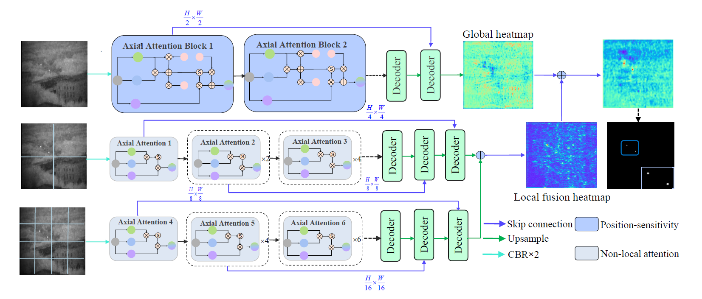

# This is no final version.I will commit all the changes after I finished my experiment. If you need it, please open issue so that I can give you the newest code. Thanks
## MPANet:Multi-Patch Attention for Infrared Target Detection
Hello,every one.This is MPAnet offical implementation.In this repo ,I will integrate nearly all
metric to this model.Because it is my first one to update a complete repo. It exists some errors in this repo.If you have
any problems, I am able to try my best to resolve your problems.
### MPANet network
A MPANet framework
based on the axial-attention encoder and the multi-scale patch
branch (MSPB) structure is proposed to highlight the small
targets and suppress background without any classification
backbones. In the designed MSPB, coarse-grained features
extracted by the large-scale branch and fine-grained features
extracted by the local branches are fused through the de-
veloped bottom-up structure. Extensive experiments on the
public SIRST dataset.

The segmentation results are as follows:

# ✨✨🎉🎉
MPANet has been accepted by IGARSS 2022 (oral).I will release a new dataset which consist of 1077 images. It includes sirst dataset, MD vs FA dataset and completely new infrared data with high quality annotations.In the meanwhile, I alse make some improvements on MPANet, which make its inference speed faster 60% than the older in a little cost. It overcomes the problem of inability to communicate between MPANet sub-patches through a pyramid-like patch fusion method.
